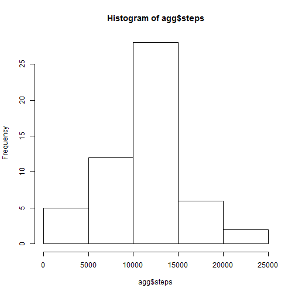
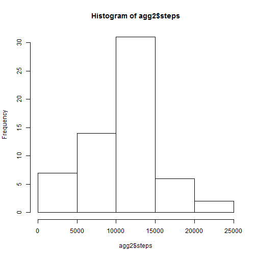
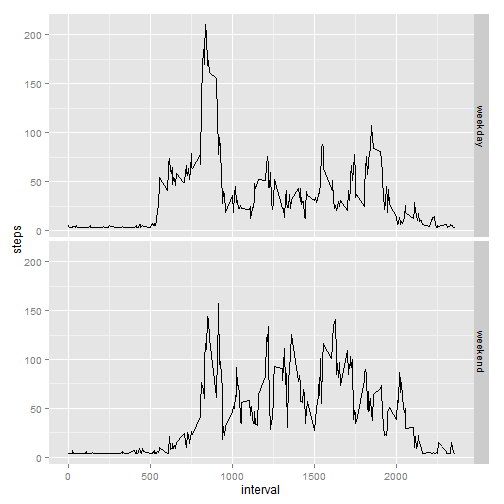

## Loading and preprocessing the data

Load the data (i.e. read.csv())


```r
data <- read.csv("activity.csv")
```

## What is mean total number of steps taken per day?

Calculate the total number of steps taken per day


```r
agg <- aggregate(steps ~ date, data = data, FUN = "sum", na.rm = TRUE)
```

Make a histogram of the total number of steps taken each day


```r
hist(agg$steps)
```

 

Calculate and report the mean and median of the total number of steps taken per day


```r
mean(agg$steps, na.rm = TRUE)
```

```
## [1] 10766.19
```

```r
median(agg$steps, na.rm = TRUE)
```

```
## [1] 10765
```

## What is the average daily activity pattern?

Make a time series plot (i.e. type = "l") of the 5-minute interval (x-axis) and the average number of steps taken, averaged across all days (y-axis)


```r
aggInterval <- aggregate(steps ~ interval, data = data, FUN = "mean", na.rm = TRUE)
plot(aggInterval, type = "l")
```

 

Which 5-minute interval, on average across all the days in the dataset, contains the maximum number of steps?


```r
maxLine <- aggInterval[which.max(aggInterval$steps),]
maxLine$interval
```

```
## [1] 835
```

## Imputing missing values

Calculate and report the total number of missing values in the dataset (i.e. the total number of rows with NAs)


```r
totalNA <- sum(is.na(data))
totalNA
```

```
## [1] 2304
```

Create a new dataset that is equal to the original dataset but with the missing data filled in.

I went with a method of filling in the missing values with the mean of that day

```r
dataDate <- aggregate(steps ~ date, data = data, FUN = "mean")
data2 <- data
NAdata <- is.na(data2)
# fill in the copied data2 df's NA values with the avg value for that date
data2[NAdata, "steps" ] <- dataDate[data2[NAdata, "date"], "steps"]
```

Make a histogram of the total number of steps taken each day and Calculate and report the mean and median total number of steps taken per day. Do these values differ from the estimates from the first part of the assignment? What is the impact of imputing missing data on the estimates of the total daily number of steps?


```r
#no use for na.rm = TRUE anymore
agg2 <- aggregate(steps ~ date, data = data2, FUN = "sum")
hist(agg2$steps)
```

 

```r
mean(agg2$steps)
```

```
## [1] 10447.65
```

```r
median(agg2$steps)
```

```
## [1] 10585.5
```

The mean and median values have decreased a little bit but the graph seems to indicate that the impact is minimal as visually it looks the same

## Are there differences in activity patterns between weekdays and weekends?

Create a new factor variable in the dataset with two levels - "weekday" and "weekend" indicating whether a given date is a weekday or weekend day.


```r
data2$date<-as.Date(data2$date, format="%Y-%m-%d")
data2$daytype <- ifelse(weekdays(data2$date) %in% c("Saturday", "Sunday"), 
                              "weekend", "weekday")
```

Make a panel plot containing a time series plot (i.e. type = "l") of the 5-minute interval (x-axis) and the average number of steps taken, averaged across all weekday days or weekend days (y-axis).

I tihnk the commented out line makes for a better graph in this case but the assignment called for the graph to be in the presented format


```r
data3 <- aggregate(steps ~ interval + daytype, data = data2, FUN = "mean")
library(ggplot2)
#qp <- qplot(interval, steps, data = data3, col=daytype, geom = "line")
qp <- qplot(interval, steps, data = data3, facets = daytype ~ ., geom = "line")
print(qp)
```

 
